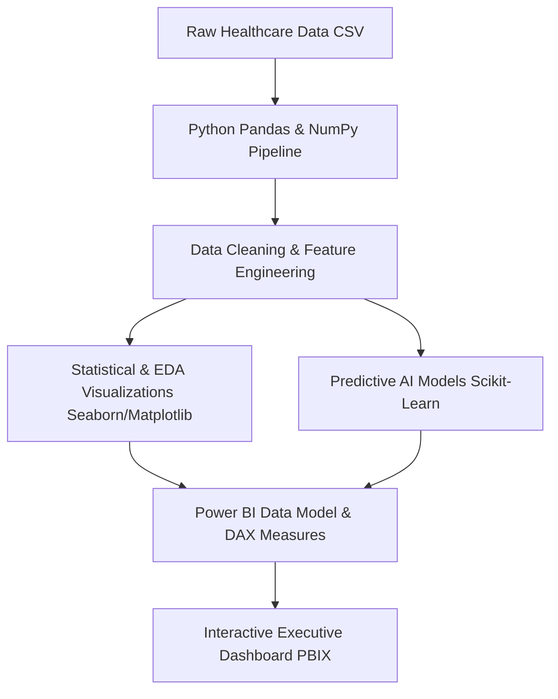

# 🏥 Apollo Hospital Healthcare Analytics & AI Demand Forecasting

[](https://github.com/sharvesh-analytics)
[](https://github.com/sharvesh-analytics)
[](https://github.com/sharvesh-analytics)
[](https://opensource.org/licenses/MIT)

> **An enterprise healthcare analytics & predictive AI platform designed for hospital operational efficiency, bed occupancy forecasting, emergency ward bottleneck prevention, and clinical resource optimization.**

---

## 📸 Dashboard Previews & Visualizations

<div align="center">
  
  
</div>

<br />

<div align="center">
  
  
  
</div>

---

## 📌 Executive  Summary

Modern hospital management requires real-time data visibility to handle fluctuating patient loads and resource constraints. This project provides **Apollo Hospital executive leadership** with a unified analytics suite that combines:
- **Exploratory Patient Analytics**: Analysis of demography, admission types, disease prevalence, and average length of stay (LOS).
- **Emergency Load Optimization**: Granular tracking of emergency ward admissions to streamline triage and staffing shifts.
- **Predictive AI Demand Forecasting**: Machine learning models predicting future patient volume, ICU bed utilization, and drug supply requirements.

---

## 🛠️ Data Architecture & Pipeline



---

## ✨  Key Capabilities & Business Impact

- 🚑 **Patient Admission & Emergency Inflow Tracking**: Real-time breakdown of emergency vs. elective admissions.
- 🩺 **Disease Trend & Diagnosis Mapping**: Identification of seasonal illness surges and clinical department workloads.
- 💊 **ICU & Bed Allocation Optimizer**: Data-backed insights to minimize patient wait times and optimize length-of-stay (LOS).
- 🔮 **AI-Driven Forecasting**: Time-series predictive modeling for upcoming bed demand and staff shift scheduling.

---

## 📊 Dataset Structure (`apollo_hospital_healthcare_data.csv`)

The underlying dataset contains comprehensive operational and clinical metrics:
- **Patient Attributes**: Age, Gender, Blood Type, Medical Condition, Admission Type.
- **Clinical Metrics**: Date of Admission, Discharge Date, Doctor Assigned, Hospital Branch.
- **Financial & Operational**: Billing Amount, Insurance Provider, Room Number, Admission Status.

---

## ⚡ Setup & Usage Guide

### Prerequisites
- [Power BI Desktop](https://powerbi.microsoft.com/) (latest build)
- Python `3.9+` with `pandas`, `numpy`, `seaborn`, `scikit-learn` installed

### 1. View Power BI Dashboard
Open [`Apollo_Hospital_Power_BI_Dashboard.pbix`](Apollo_Hospital_Power_BI_Dashboard.pbix) in Power BI Desktop to interact with the slicers, cross-filtering, and DAX KPIs.

### 2. Run Python Analytics Pipeline
```bash
# Clone the repository
git clone https://github.com/sharvesh-analytics/Apollo-Hospital-Healthcare-Analytics-AI-Forecasting-Dashboard.git
cd Apollo-Hospital-Healthcare-Analytics-AI-Forecasting-Dashboard

# Install required packages
pip install pandas numpy seaborn matplotlib scikit-learn
```

---

## 📜 License

Distributed under the MIT License. See `LICENSE` for details.

---

<div align="center">
  <sub>Designed & Developed by <b>Sharvesh Pandey</b> | Data Analyst & AI Specialist</sub><br/>
  <a href="https://www.linkedin.com/in/sharvesh-analytics"><b>LinkedIn</b></a> • <a href="https://github.com/sharvesh-analytics"><b>GitHub Profile</b></a>
</div>
